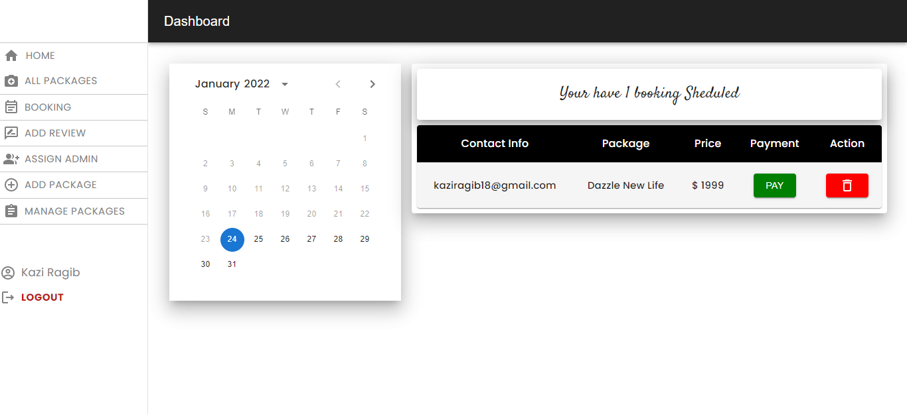

# Dazzle Photograghy Website 
Dazzle is wedding photography website that offer simple, customisable packages, high res images for their event with affordable, combo packages with flexible payment options.We specialises in event photography with the natural reportage documentation of speacial occasions and celebrations, producing the highest quality imagery that showcase your wedding and event in its best possible light.

### `Live Link:`  https://dazzle-photography-website.web.app/

### `All Features:` 
 - The site is designed with Material ui, Styled Component, html & Css. Aos used to for ui animation & sweetalert for beautiful alert messages.
 - It is also designed with a user/admin dashboard.
 - User can explore & book package for their event.
 - User can use dashboard for payment and give dynamic star review of the services & used react slick to show the review on Ui.
 - The review page has a image upload system where user can upload image locally form their device.
 - Material Ui calender added with date-fns where user can select event date and book pacakge, they can also find there order in the dashboard calander to sort order in a table.
 - User can view their order on dashbord table where they can cancel their order and also access the stripe payment page.
 - Website is secure with JWT and Firebase Admin with admin and private route.
 - Admin can manage and create new service orders or delete them.
 - Admin can assign new admin role to user in Assign admin page through admin dashbord.
 - Toggle Registration & Login, implement sign in with email password implemented.
 - Added Google Signin using custom hook with on State Change.
 - Implement Sign out and display logged in User name in dashboard.
 - Created Use Firebase hooks for shared authentication.
 - Create React App with Environment variable for Firebase.
 - Used useAuth custom hook and create private route.
 - Implemented Auth Redirect.
 - Saved user information to backend database. 
 - Created Package, Booking, Review, User api with CRUD opertation.
 - Api data is send from backend mongodb database server which is hosted in heroku.
 - The website is hosted in firebase.
 
 ### `Website Preview:` 
 
 
 
